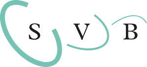
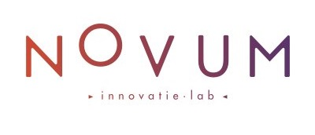
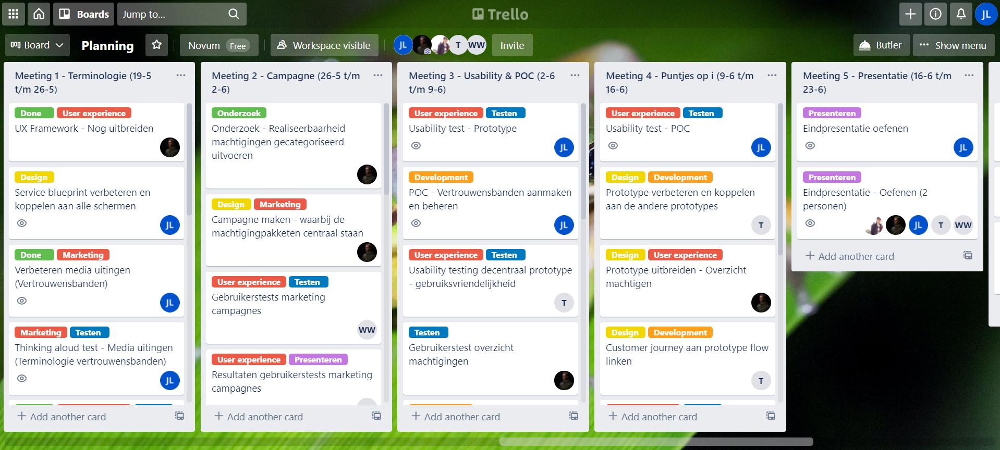

# &nbsp;

# Voorwoord

Beste lezer,

Dit verslag beschrijft het proces dat ik doorgelopen heb tijdens semester 6.

Mijn naam is Jens van Lierop en ik ben een laatstejaars student van de opleiding HBO ICT & Media Design aan de Fontys Hogescholen in Eindhoven. Van 9 februari tot 19 april heb ik samen met een team van 4 medestudenten aan een project gewerkt rondom het onderwerp machtigen voor het Novum innovatielab van de Sociale Verzekeringsbank.

Allereerst wil ik onze opdrachtgever, Matthijs Goense, bedanken voor de zijn betrokkenheid bij het proces, de tijd die hij elke week voor onze wekelijkse meeting vrijmaakt en de mogelijkheden die hij ons biedt om ons werk te presenteren aan verschillende belanghebbende groepen.

Ook wil ik mijn waardering naar mijn groepsgenoten en semestercoaches uitspreken, voor alle prettige meetings (vooral gedurende deze coronaperiode) en waardevolle feedback die ik van hen heb mogen ontvangen.

De lezer van dit document wens ik graag veel leesplezier toe en mocht je aan het einde meer willen weten over dit project, voel je vrij om contact op te nemen.

 

# Samenvatting

Dit project heeft betrekking op het onderwerp machtigen. Door iemand te machtigen geef je diegene toestemming om namens jou te handelen. Wanneer een persoon bepaalde zaken zelf niet meer kan door bijvoorbeeld ouderdom of een ongeluk, kan hij of zij ervoor kiezen om een vrijwillige machtiging af te geven. Meestal wordt een naaste zoals een familielid hiervoor gekozen.

Steeds meer zaken vinden online plaats en de huidige manier van digitaal machtigen blijkt niet te werken voor de machtiging gevers en ontvangers. De interface is niet gebruiksvriendelijk/intuïtief genoeg voor de gebruiker en vaak kan er niet de juiste toegang verkregen worden of levert het een stapel aan extra papierwerk op. Dit resulteert in het delen van DigiD wachtwoorden wat erg gevaarlijk en zelfs strafbaar is.

De Sociale verzekeringsbank krijgt veel te maken met dit soort gevallen, omdat een groot deel van hun klanten in de AOW-leeftijd valt en regelmatig iemand moeten machtigen. Aan hun innovatielab, Novum, hebben ze de opdracht uitgezet om hier verbetering in te brengen. De hoofdvraag is hoe we digitaal machtigen toegankelijk kunnen maken voor alle burgers in Nederland.

Uit ons onderzoek is duidelijk behoefte aan een toegankelijke en eenduidige manier van machtigen, waarmee je zelf de zaken in handen hebt. Deze oplossing moet een persoonlijkere en toegankelijke manier bieden om anderen te machtigen.

Het concept dat we hiervoor hebben uitgewerkt is een centraal register voor machtigingen met decentrale embedded plugin(s) voor organisaties, zodat de machtiging bij de organisatie zelf wordt aangevraagd, maar wel steeds op dezelfde manier verloopt, Binnen dit concept wordt de persoonlijke band tussen een machtiging gever en -ontvanger uitgelicht door ze de optie te geven deze vast te leggen. Op deze manier kunnen organisaties gemakkelijk controleren wie bij elkaar horen en hoeven de personen zelf dit niet steeds opnieuw voor elke organisatie aan te tonen.

De 5 hoofdelementen binnen dit concept zijn: Centraal-decentraal hybride structuur, vertrouwensbanden, machtigingspaketten en -categorieën, Conversational UI en tegelijkertijd richting een machtiging werken. 

Om dit in beeld te brengen is er op basis van een service blueprint en de rijkshuisstijl een prototype gerealiseerd. Ook is er een communicatiestrategie opgezet om de vertrouwensbanden uit te leggen. De strategie berust op het gebruiken van de kanalen van de overheid en partnerships met organisaties om de adoptie van het systeem op gang te brengen.

Uit testen met de prototypes en media uitingen uit het communicatieplan bleek dat het expliciet vastleggen van de vertrouwensbanden niet de juiste oplossing is en dat mensen specifiek willen weten wie de gever en ontvanger is van machtigingen. Hieruit is besloten om bestaande machtigingsrelaties te kunnen verifiëren in plaats van deze in een parallel proces vast te leggen.

 

# Summary

This project is related to the topic of authorizing. By authorizing someone you give them permission to act on your behalf. When a person is no longer able to do certain things by himself, for example due to old age or an accident, he or she can choose to issue a voluntary authorization. Usually a loved one such as a family member is chosen for this.

More and more business is taking place online and the current way of digital mandate does not appear to work for mandators and recipients. The interface is not user-friendly / intuitive enough for the user and often the correct access cannot be obtained or it results in a pile of extra paperwork. This results in the sharing of DigiD passwords which is very dangerous and even punishable.

The Social Insurance Bank has a lot to do with these types of cases, because a large part of their customers are of the state pension age and regularly have to authorize someone. They have assigned the task of improving this to their innovation lab, Novum. The main question is how we can make digital mandates accessible to all citizens in the Netherlands.

From our research, there is a clear need for an accessible and unambiguous way of empowering you, which puts you in control. This solution should provide a more personal and accessible way to empower others.

The concept that we have developed for this is a central registry for authorizations with decentralized embedded plugin (s) for organizations, so that the authorization is requested from the organization itself, but always takes place in the same way. giver and receiver by giving them the option to record them. In this way organizations can easily check who belong to each other and the persons themselves do not have to demonstrate this again and again for each organization.

The 5 main elements within this concept are: Central-Decentralized Hybrid Structure, Trust Ties, Entitlement Packages and Categories, Conversational UI and working towards an authorization at the same time.

To visualize this, a prototype was realized based on a service blueprint and the government branding. A communication strategy has also been set up to explain the relationships of trust. The strategy relies on using government channels and partnerships with organizations to drive adoption of the system.

Tests with the prototypes and media expressions from the communication plan showed that explicitly recording the bonds of trust is not the right solution and that people specifically want to know who the giver and receiver of authorizations are. From this it was decided to be able to verify existing authorization relationships instead of recording them in a parallel process.

 

# Verklarende Woordenlijst

#### A

**Application Programming Interface (API):** Een software koppelstuk die twee applicaties in staat stelt met elkaar te praten

#### B

**Back End:** De achterkant van een softwaresysteem: Dit bevat meestal de logica van de applicatie is is verantwoordelijk voor het ophalen en verwerken van data.

#### C

**Conversational User Interface (CUI):** Gebruikersinterface waarin de een menselijk gesprek wordt nagebootst. (Bijvoorbeeld dmv. Een chatbot)

#### F

**Front end:** De voorkant van een softwaresysteem: Dit is het gedeelte waarmee de gebruiker interactie heeft, zoals een webformulier of mobiele applicatie.

#### M

**Machtigen:** Het overdragen van een autorisatie van een actor naar een andere actor. (Actor = mens, bedrijf of geautomatiseerd systeem).

**Multifactorauthenticatie (MFA):** Een authenticatiemiddel waarbij de gebruiker middels meerdere authenticatie stappen moet inloggen.

#### U

**User Experience:** De ervaring die een persoon beleeft bij het gebruiken van een product/dienst

 

# 1. Inleiding

Ieder mens heeft taken en verplichtingen; Je zorgverzekering regelen, de belastingaangifte doen, betalingen doen etc. Het liefste doe je natuurlijk alles zelf, maar wat als dit niet gaat? Dan ga je natuurlijk op zoek naar hulp. Dit is waar het begrip machtigen zijn intrede doet.

Door iemand te machtigen geef jij een ander toestemming om namens jou zaken te doen. En hoewel dit in theorie heel makkelijk klinkt is het in de praktijk nog lang niet zo eenvoudig. Machtiging gevers en -ontvangers moeten door allerlei hoepels springen om elkaar te kunnen helpen, terwijl het afdragen van zaken op zichzelf al een heel erg ingrijpende gebeurtenis kan zijn in het leven van een persoon.

Ondertussen vinden steeds meer zaken online plaats en de huidige digitale manier van machtigen maakt het alleen maar lastig voor mensen om elkaar goed te kunnen helpen.

In een tijdperk waarin de digitalisering steeds verder toeneemt en de vergrijzing ervoor zorgt dat mensen steeds vaker hulp van anderen nodig hebben, is het essentieel dat er een oplossing komt voor het probleem rondom digitaal machtigen.

In de aankomende hoofdstukken gaan we op dit probleem in.

Hoofdstuk 2 geeft informatie over de SVB en het Novum innovatielab die dit probleem willen aanpakken voor zowel hun eigen klanten als op rijksbreed niveau. Hoofdstuk 3 geeft alle details over de opdracht. In hoofdstuk 4 komt de onderzoeksfase aan bod waarin de probleemstelling en de context verder worden uitgediept. In hoofdstuk 5 wordt er een concept opgesteld, dat in hoofdstuk 6 wordt uitgewerkt tot design. In hoofdstuk 7 wordt het concept getest aan de hand van gebruikers en UX frameworks. Hoofdstuk 8 gaat over de realisatie van het concept zowel in technische zin als op het gebied van marketing. En als laatste wordt er in hoofdstuk 9 een conclusie getrokken en worden er aanbevelingen gedaan voor de aankomende periode.

 

# 2. Het bedrijf

Allereerst volgt een beschrijving van het bedrijf waarvoor de opdracht wordt uitgevoerd.

	

## 2.1 Sociale verzekeringsbank

De Sociale Verzekeringsbank voert al meer dan 115 jaar volksverzekeringen in Nederland uit. Hieronder vallen regelingen zoals de AOW, de Algemene nabestaandenwet en kinderbijslag. Ook regelt de SVB enkele overige zaken zoals het persoonsgebonden budget (pgb). Dit zijn regelingen voor ouderen, ouders, ouders met gehandicapte kinderen, gepensioneerden die bijstand nodig hebben, houders van een persoonsgebonden budget, nabestaanden, asbestslachtoffers, remigranten, verzetsdeelnemers en oorlogsgetroffenen en mensen die tijdelijk in het buitenland gaan werken.

De SVB heeft ongeveer 5,5 miljoen klanten en keert elk jaar ongeveer 45 miljard euro uit aan mensen die hier recht op hebben. De SVB is een zelfstandig bestuursorgaan. Het bestuur van de SVB wordt benoemd door de minister van Sociale Zaken en Werkgelegenheid.

	

## 2.2 Novum

Novum is het innovatielab van de sociale verzekeringbank. Het is een autonoom opererende afdeling die zich in het kader van sociale zekerheid bezighoudt met impactvolle vernieuwing vernieuwing. Samen met een netwerk van overheden en bedrijven voeren ze projecten uit op basis van de laatste technologische en maatschappelijke trends. Technieken waren ze onder andere mee experimenteren zijn Spraakbesturing, Blockchain en Artificial Intelligence.

Onze contactpersoon is Matthijs Goense: Innovation Designer & Portfolio manager bij het Novum innovatielab.

 

# 3. De opdracht

Onderstaande probleemstelling heeft betrekking op het onderwerp machtigen: Degene die een machtiging afgeeft zal nader worden benoemd als 'gever' en degene die een machtiging ontvangt als 'ontvanger'

## 3.1 Probleemstelling 

Administratieve zaken worden steeds vaker op een digitale manier verwerkt. Meer dan de helft van de klanten van de SVB (Sociale Verzekeringsbank) doen hun zaken online. Veelal van deze klanten zitten in de AOW en vaak zijn zij vanwege ouderdom of gezondheidsredenen niet meer in staat alles zelf te doen. Daarom wordt vaak een ander (bijvoorbeeld een familielid) door deze persoon gemachtigd om zaken te doen namens deze persoon. Echter hier stuitten ze op een probleem.

De huidige digitale manier van machtigen blijkt niet intuïtief genoeg te zijn voor de gebruikers en dit resulteert in het delen van DigiD wachtwoorden. Niet alleen brengt dit enorm veel gevaren met zich mee, omdat een persoon dan volledige toegang heeft tot jouw online identiteit, ook is het technisch gezien wettelijk strafbaar. Daarnaast zal het probleem rondom digitale machtigingen toenemen zolang de vergrijzing van Nederland en het gebruik van digitale middelen toeneemt. Ook zal op den duur het delen van wachtwoorden moeilijker worden door het toenemen van tweestapsauthenticatie.

##  3.2 Opdrachtomschrijving

Er moet een standalone prototype worden opgeleverd bestaande uit een front en backend waarin een machtigingsproces wordt gesimuleerd. Het systeem moet een eenduidige oplossing bieden en dient passend te zijn voor de doelgroep en context. Tevens moet de mogelijke adaptatie van een conversational user interface worden onderzocht en toegepast indien mogelijk.

## 3.3 Doelen 

Het doel van de opdracht is om digitaal machtigen toegankelijk te maken voor een zo breed mogelijk publiek. Daarbij is het belangrijk dat deze doelgroep wordt aangezet tot het gebruiken van dit digitale machtigingssysteem, zodat het zo veel mogelijk geautomatiseerd kan worden en daarom minder menselijke hulp nodig is om alle aanvragen te verwerken. Belangrijk is dat de veiligheid van de gebruikers van dit platform te allen tijde wordt gewaarborgd.

## 3.4 Onderzoeksvragen

#### Hoofdvraag

Hoe kunnen we machtigen op een laagdrempelige, digitale en veilige manier toegankelijk maken voor alle burgers in Nederland?

#### Deelvragen

**Wat is machtigen precies?**

- Welk type machtigingen kun je van elkaar onderscheiden? Zijn hier andere wetten en rechten aan verbonden? Zijn er verschillen in het machtigingsproces?

- Wie verwerkt een machtiging? Hoe worden deze wijzigingen opgeslagen?

- Hoe ziet machtigen eruit in de praktijk? Wat zijn de voornaamste redenen om iemand anders te machtigen?

- Hoe vaak moeten er machtigingen vrijgegeven worden? Doe je dit eenmalig of moet dit vaker gedaan worden?

  

**Wie is/zijn de verschillende doelgroepen? Wat zijn hun kenmerken?**

- Hoe ziet de opbouw van de gevers eruit? Welke fysieke of cognitieve beperkingen hebben deze mensen, waardoor ze zelf niet meer in staat zijn om zelf hun zaken te regelen?

- Hoe ziet de opbouw van de ontvangers eruit? Kunnen zij overweg met het aangeboden digitale platform?

- Tot welke digitale middelen en analoge middelen hebben deze doelgroepen toegang en waarmee kunnen ze overweg?

- Welk type actor wordt er gemachtigd? Andere personen, bedrijven, digitale systemen? Allemaal?

- Hoe verhoudt de relatie tussen de gever en ontvanger zich gebruikelijk? Hoe kun je deze relatie verifiëren en zelfs vastleggen?

  

**Hoe zorg je ervoor dat de oplossing simpel en eenvoudig in gebruik is en aansluit op de doelgroep?**

- Hoe zorg je ervoor dat de doelgroep zich veilig en vertrouwd voelt bij het geven van een machtiging? Hoe creëer je een persoonlijke ervaring?

- Tot welk niveau moeten mensen elkaar kunnen machtigen? Hoe gedetailleerd ben je in het definiëren van een machtiging? (Controleren, aanpassen, verwijderen, aanmaken)

- Kan er een gedeelte van het probleem uit handen worden genomen door de ontvanger? Oftewel kan het probleem worden omgedraaid tot het sturen van een machtigingsverzoek?

## 3.5 Onderzoekscyclus

#### Onderzoeksstrategieën

Als basis van de onderzoekscyclus staat het Development Oriented Triangulation (DOT) framework. Dit framework bestaat uit 3 niveaus (Application domain, Available work en Innovaion space) en 5 verschillende strategieën (Field, Library, Workshop, Lab en Showroom). (*The DOT Framework - ICT research methods*, z.d.)

De hierbij correcte manier van onderzoek is het combineren van methodes uit verschillende strategieën om tot één resultaat te komen (triangulatie).

#### Project Management

Daarnaast zal er gedurende het project volgens de waterval methode gewerkt worden. In deze methode worden alle verschillende activiteiten onderverdeeld in een aantal opeenvolgende projectfases die stapsgewijs doorlopen zullen worden. Elke fase is hierbij afhankelijk van de deliverables van de fase ervoor.

De projectfases zijn als volgt opgedeeld: Onderzoeksfase, Conceptfase, Ontwerpfase, Testfase, Ontwikkelfase. Daarnaast is het project opgedeeld in twee periodes van 9 weken.

In onderstaande Gantt chart staan alle activiteiten voor het project globaal uitgepland op basis van datum en duur op kleiner niveau wordt er gepland met behulp van een Trello bord.

(Gantt Chart)

(Trello Bord)

> # Inhoudelijke hoofdstukken {docsify-ignore}
> #### [Periode 1: Centraal machtigingen Register ](/fase1.md ) {docsify-ignore}
> #### [Periode 2: Vertrouwensbanden](/fase2.md) {docsify-ignore}

