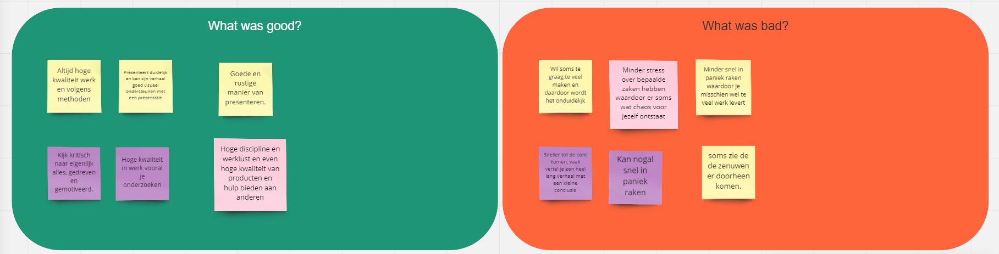

# &nbsp;

# 9. Conclusies en Aanbevelingen

Om digitaal machtigen toegankelijker te maken voor alle burgers in Nederland moeten er twee dingen gebeuren:

1.  Machtigen moet op een eenduidige manier gebeuren, ongeacht van de organisatie (bank, verzekeraar, overheidsinstantie) waar de machtiging wordt aangevraagd. Daar waar mogelijk moet het voor de gebruikers mogelijk worden om op een centrale plaats machtigingen aan te vragen. In alle andere gevallen moeten gebruikers worden voorzien van een oplossing (plugin) die op elke website van de dienstverlener hetzelfde is, zodat het machtigingsproces altijd hetzelfde is.
2.  Er moet ingezet worden op de relatie tussen een machtiging gever en machtiging ontvanger. Machtigen is een zeer persoonlijk proces en mensen hebben van nature de neiging om naar mensen die ze kennen te gaan voor hulp. Deze personen moeten daarom ook de mogelijkheid krijgen om elkaar te helpen bij het aanvragen van machtigingen. Wanneer er eenmaal een machtiging is aangevraagd moet er de optie zijn om elkaar vaker/meermalig te machtigen op basis van de machtigingshistorie.

Om dit concept daadwerkelijk te kunnen realiseren is de samenwerking met organisaties cruciaal, omdat het systeem nutteloos is wanneer je niet de machtigingen kunt aanvragen die je nodig hebt als gebruiker. Organisaties moeten daarom ook de middelen krijgen, zodat de adoptie van het systeem op een vlekkeloze manier en een zo groot mogelijke schaal verloopt .

Om te voorkomen dat er alsnog wachtwoorden gedeeld worden tussen machtiginggevers-  en ontvangers moet het publiek bewust worden gemaakt van het nieuwe systeem door middel van verschillende overheidscampagnes.  Organisaties kunnen hierbij dienen als Brand Ambassadors van het Centrale Machtigingen Register.

# Evaluatie

Met betrekking tot persoonlijke reflectie is het belangrijk voor mijzelf mijn nauwkeurige werkwijze niet om te laten slaan in perfectionistisch. Dit perfectionisme zorgt ervoor dat ik langer bezig ben met taken die normaliter niet zoveel tijd in beslag zouden moeten nemen. Bovendien is het gevolg dat er sprake is van een tunnelvisie, waarbij ik minder opensta voor nieuwe ideeën of inzichten. Dit leidt tot minder flexibiliteit in mijn project en dit wil ik graag voorkomen door bewuster aan de slag te gaan. Bij dit project merk ik dat gestructureerd werken goed van pas komt en dit wil ik dan ook gedurende het hele project toepassen op mijn werk.

In een Retrospective die we met het team gehouden hebben kwam naar voren dat mijn werkwijze invloed heeft op mijn uitstraling. Er werd aangekaart dat ik erg gedreven en gemotiveerd ben, maar dat er wel momenten zijn dat ik gestrest of zenuwachtig overkom. Ik was me hier niet van bewust en in de toekomst wil ik graag de rust vinden in mijn werkwijze, zodat ik zelf ook een minder chaotische uitstraling heb, vooral wanneer ik aan het presenteren ben.

Met betrekking tot de opdracht zelf is het verstandig om op elk moment als team bij te houden wat de probleemstelling is en hoe ver de scope van het project reikt. Dit kan namelijk erg fluctueren van moment tot moment en moet tijdig afgestemd worden met de opdrachtgever om te voorkomen dat we dus breder te werk gaan dan oorspronkelijk gepland is.

Daarnaast is het zinvol om een soort gezamelijke FAQ of wiki bij te houden wanneer je in een team werkt. Ik merkte namelijk dat er over zaken die we slecht hadden gedocumenteerd, onderling heel veel verschillende meningen waren binnen ons team. Een single source of thruth is dan ook wel prettig om te kunnen raadplegen zodat alle koppen in het team dezelfde richting op wijzen.

Als laatste is de voorbereiding op meetings en het strakker plannen van tijd een puntje. Het van tevoren sturen van een agenda, inhoud en eventuele vragen kan een gesprek veel beter stroomlijnen en voorkomt onnodige uitloop of afdwalingen. Halverwege het semester is dit door ons team opgepakt en dit zorgde ervoor dat onze meeting veel soepeler verliepen.