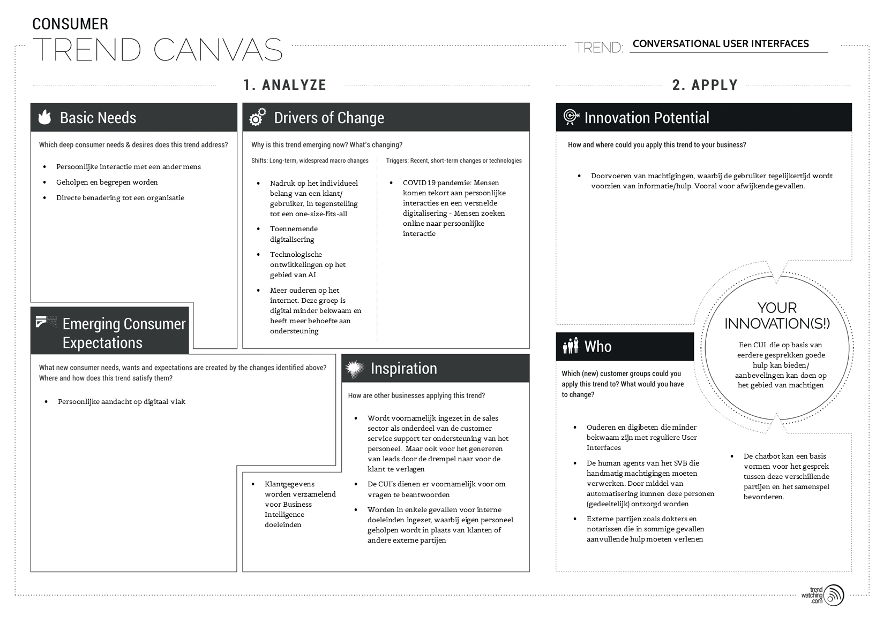
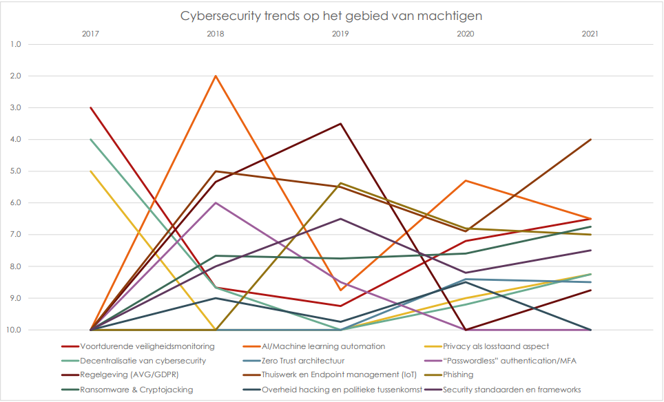
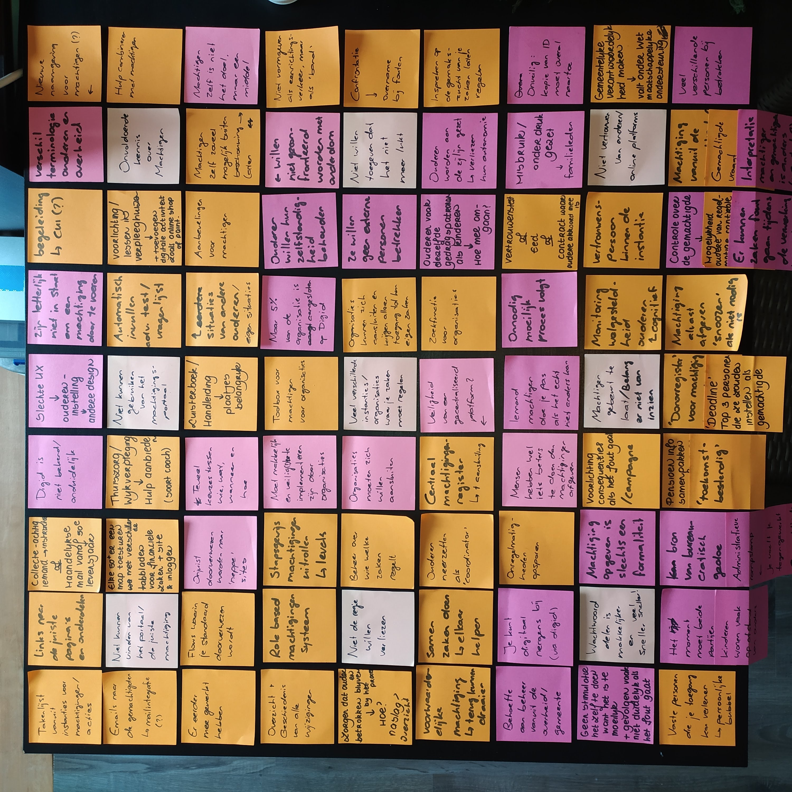
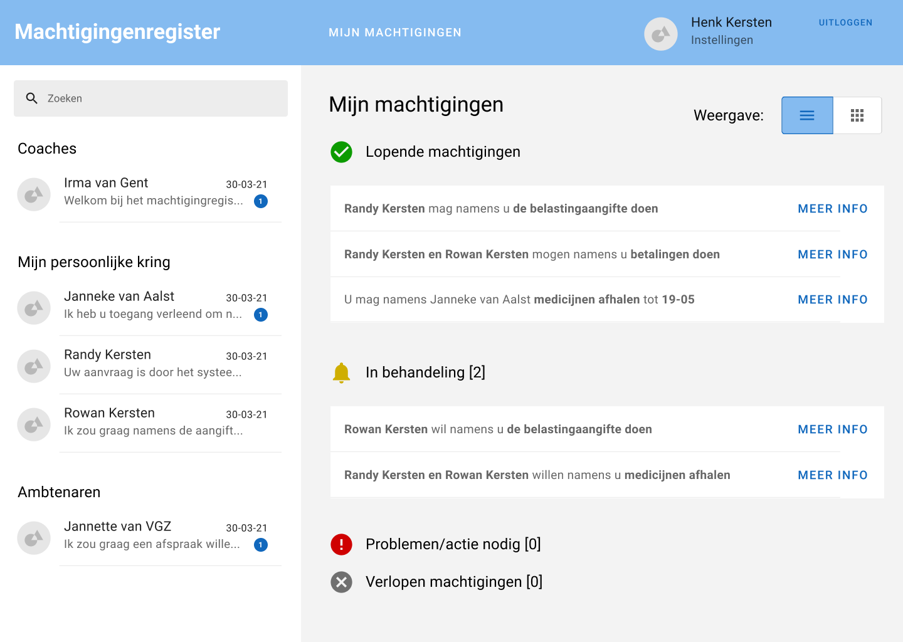
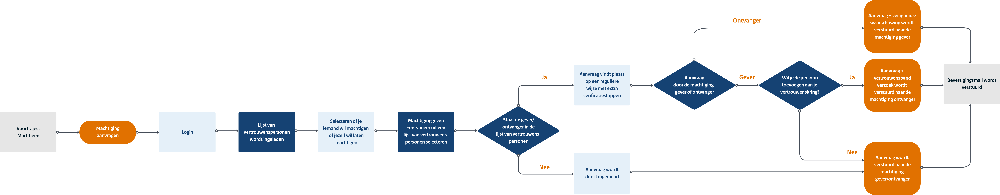
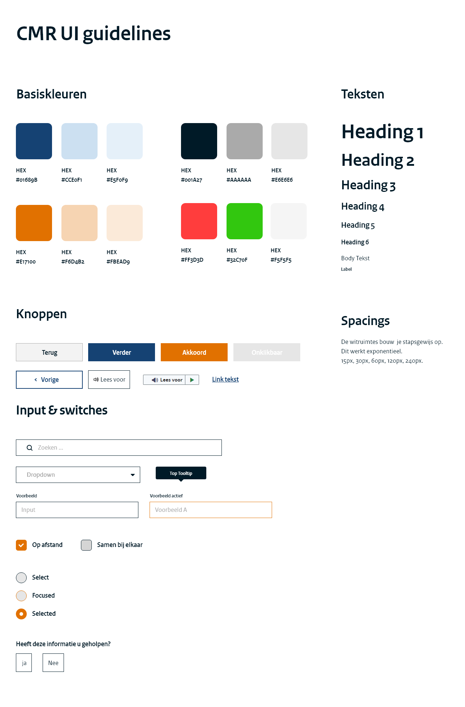

# &nbsp;

# 4. Onderzoeksfase

Allereerst zijn we als team aan de slag gegaan met onderzoek om een beter beeld te krijgen over machtigen en de probleemstelling verder uit te diepen.

## 	4.1 CUI Trend onderzoek :id=cui-trend-onderzoek

Omdat er vanuit de opdrachtgever interesse is voor de implementatie van Conversational User Interfaces, stond het eerste onderzoek in het kader van deze techniek en de laatste ontwikkelingen.

Het meest opvallende resultaat van dit onderzoek was dat Conversational UI op zichzelf staand een sterk groeiende trend is. Niet alleen wordt het toegepast op het gebied van online dienstverlening en -sales, maar ook in de verbetering en ondersteuning van interne bedrijfsprocessen. Het voornaamste doel van deze CUI's is het beantwoorden van vragen en eigenlijk alle laatste ontwikkelingen duiden op een behoefte naar een persoonlijke beleving die niet te onderscheiden is van een menselijke interactie. Om dit te bereiken is de inzet van Artificial Intelligence nodig die van elk gesprek leert, waardoor toekomstige interacties steeds beter worden. Ook moet de CUI een 'persoonlijkheid' krijgen, waarbij de CUI menselijke taal begrijpt en spreekt, maar ook een echte persoonlijkheid krijgt die bij de doelgroep past. Tevens kan AI worden toegepast om klantgegevens te verzamelen te verbetering van de dienstverlening.

De resultaten van dit onderzoek zijn opgenomen in een Consumer Trend Canvas (TrendWatching BV, 2014) om de implementatie voor onze context in beeld te brengen.

>  [Meer informatie](/hoofdstukken/1.%20Trends%20Onderzoek%20CUI.pdf ':ignore')
>
>  [Consumer Trend Canvas (volledige grootte)](/bijlagen/Trend%20canvas.pdf ':ignore')

 

## 	4.2 Cybersecurity Trend onderzoek :id=cybersecurity-trend-onderzoek

In een tweede stap heb ik onderzoek gedaan naar het veiligheidsaspect van digitaal machtigen. Cybercriminaliteit is namelijk een toenemende dreiging en het kan heel lucratief zijn om onbedoeld gemachtigd te worden voor zaken van een ander.

Uit dit onderzoek kwamen enkele belangrijke aspecten waaronder AI, Phishing, Endpoint Management en AVG/Privacy. Vooral phishing zou mogelijk problemen kunnen vormen voor de doelgroep, omdat deze trend inspeelt op de zwakte van de mens en ouderen/digibeten, vaak minder bekwaam zijn in het herkennen van dit soort valstrikken. De applicatie zal dan ook minimaal gebruik moeten maken van patronen die makkelijk misbruikt kunnen worden, zoals doorverwijzingen via hyperlinks of push notificaties.

Omdat het bij machtigen vaak gevoelige informatie betreft zal er ook rekening moeten gehouden worden met zowel de privacy van de gebruiker als de wetgeving. Daarom zal er op een veilige en vertrouwelijke manier moeten omgegaan met de data en authenticatie op een goede manier moeten verlopen.

Onderstaande grafiek geeft de gemiddelde positie van de cybersecurity trends per jaar weer.

>  [Meer informatie](/hoofdstukken/2.%20Trends%20Onderzoek%20Cybersecurity.pdf ':ignore')
>
>  [Ruwe onderzoeksdata](/bijlagen/Ruwe%20onderzoeksdata.pdf ':ignore')

 

## 	4.3 Business Model Canvas :id=business-model-canvas

In een kleine zijstap op voorgaande onderzoeken heb ik door middel van een Business Model Canvas vanuit bedrijfsperspectief gekeken naar machtigen. Op deze manier kan er ontdekt worden of er niet alleen op sociaal vlak iets te behalen valt maar ook of organisaties er baat bij kunnen hebben. Machtigen is namelijk voor alle betrokken partijen een lastig probleem dat vooral veel tijd en geld kost.

Het business model canvas is een strategisch management format waarmee nieuwe bedrijfsmodellen kunnen worden opgesteld/ bestaande modellen in kaart kunnen worden gebracht. Onderstaand figuur geeft de Business Model Canvas neer voor het SVB in de context van machtigen.

Uit bovenstaande figuur kun je afleiden dat op het moment machtigingen vooral afgehandeld worden door menselijk handelen, waarbij een telefonisch gebrek het huidige beleid is. Dit is niet bevorderend voor de doelmatigheid: de kosten (van het personeel) staat niet in verhouding met de kwaliteit van het werk.

Er zijn drie mogelijke verbeteringen voor het stroomlijnen van de huidige situatie:

1. Automatisering van het machtigingsproces door middel van technologie

2. Ondersteunende middelen voor het personeel dat hulp biedt bij machtigingen

3. Betere basis voor het huidige machtigingsproces zodat er minder ondersteuning nodig is Of een combinatie van bovenstaande punten kan toegepast worden.

   

>  [Meer informatie](/hoofdstukken/3.%20Business%20Model%20Canvas.pdf ':ignore')
>
>  [Business Model Canvas (volledige grootte)](/bijlagen/Business%20Model%20Canvas.pdf ':ignore')

 

## 	4.4 Kennisdeelsessie :id=kennisdeelsessie

De laatste stap die we als team ondernomen hebben voor de conceptfase is het houden van een kennissessie met een team dat werkt aan een gelijksoortig project.

Ons onderzoeksteam is namelijk niet de enige groep die aan het probleem rondom machtigen werkt. Onder de naam "Gebruiksvriendelijk vrijwillig machtigen van familieleden, mantelzorgers en buddy's " werkt een team van de gemeenten Amsterdam, Almere en Leiden ook aan een project om het probleem rondom machtigen de wereld uit te werken.

Omdat dit team al langer bezig is en dichter op de stof zit kan het beschouwd worden als een soort expert interview, Ter voorbereiding is er dan ook een agenda en interviewplan uitgezet om het maximale uit de beperkte tijd te halen.

Onderstaand is een korte overview van de bevindingen van het nadere team. Meer informatie is terug te vinden in het interviewplan in de bijlage en de Notion omgeving van het projectteam zelf (Gemeente Amsterdam, Almere en Leiden, 2021).

#### Probleemstelling

Machtigen is een probleem onder mantelzorgers. Bij elke organisatie moet machtigen op een andere manier en ze moeten steeds weer opnieuw aantonen dat ze gemachtigd zijn, waarbij elke keer weer kopieën nodig zijn van de ID-kaart + de benodigde documenten. In sommige gevallen is het vrijwel onmogelijk om een machtiging te vekrijgen en daardoor worden mantelzorgers gedwongen tot het nemen van 'olifantenpaadjes', waarbij ze via DigiD zich voordoen als de machtiginggever, ondanks dat dit wettelijk verboden is. Dit maakt machtigen tot een onveilige maar ook vooral een onprettige ervaring die de aandacht wegneemt van hetgeen dat er echt toe doet: Het zorgen voor je naaste.

#### Oplossing

De oplossing komt in de vorm van een centraal toestemmingenregister, waarin machtigingen op een toegankelijke manier kunnen worden 'aangezet' en 'uitgezet' door de machtiginggever in een online portaal. Deze machtigingen kunnen via een videogesprek worden geverifieerd door een gemeenteambtenaar/notaris. Door te machtigen op deze eenduidige wijze, komt het beheer meer bij de machtiginggever te liggen.

Er was vooral veel overlap tussen de resultaten van ons team en het andere team.
De punten die het onderzoeksteam van gemeente Amsterdam en Leiden met name waardevol vonden waren: CUI (Conversational UI - Chatbot-AI), Centrale index die een API voor alle voor alle machtigingszaken en websites gebruikt, Dashboard machtigingsrelaties idee -- vertrouwensrelatie.

>  [Meer informatie](/hoofdstukken/5.%20Kennisdeelsessie.pdf ':ignore')
>
>  [Agenda en Interviewplan](/bijlagen/Kennisdelingsessie.pdf ':ignore')

 

# 5. Conceptfase

Nadat de onderzoeksresultaten van elke groep verzameld zijn en er een volledig beeld van de probleemstelling is, kunnen de eerste stappen gezet worden richting een concept. In de conceptfase wordt er gewerkt van probleem naar oplossing.

## 	5.1 Ideation :id=ideation

Om zoveel mogelijk ideeën te genereren heeft ieder groepslid een eigen brainstormsessie gehouden, zodat we zonder door elkaar beïnvloed te worden met originele ideeën zouden komen.

#### Brainstorming

Ik heb de Lotus brainstorm techniek toegepast in mijn ideation proces. Dit brainstorming 'framework' deelt het probleem op in 8 deelaspecten en daagt je uit om voor elk van deze aspecten 8 nieuwe ideeën te verzinnen. De deelaspecten komen voort uit de probleemstelling en hebben te maken met het niet kunnen vinden en gebruiken van het machtigingsportaal en het niet willen afstaan van machtigen uit principe of wantrouwen.

Onderstaande foto geeft het resultaat van de brainstormsessie weer: De lichtroze sticky notes geven deelaspecten aan, de donkerroze items zijn problemen en de oranje notes geven oplossingen weer.

De belangrijkste verbeterpunten zijn in mijn ogen:

- Het beter vindbaar maken van machtigen door het vanuit een centrale plaats of op een eenduidige manier vorm te geven.

- Door de oudere een coördinerende rol kan deze oudere toch het gevoel van regie en autonomie behouden.

- Nadruk leggen op het persoonlijke verband tussen een machtiger en gemachtigde in plaats van de handeling zelf

- Voorbereidende regelingen voor machtigingen, zodat het vantevoren is geregeld.

  

#### Dot Voting

We hebben na ons individuele brainstormproces alle ideeën verzameld en deze met de opdrachtgever behandeld in een dot voting sessie waarin hij kon aangeven welke aspecten waardevol zijn en welke minder.

Matthijs was vooral geïnteresseerd in een centrale/eenduidige manier om te machtigen. Hij hecht daarbij vooral veel waarde aan persoonlijke interactie en vond het idee van een persoonlijke 'vertrouwensbubbel' een sterk idee. Daarnaast zag hij waarde in het gebruik van touchpoints op websites om de gebruiker richting machtigingen te 'sturen.'

>  [Meer informatie](/hoofdstukken/4.%20Ideation%20Proces.pdf ':ignore')

 

## 	5.2 Concept Pitch :id=concept-pitch

Met een rijke backlog aan informatie en input van zowel de opdrachtgever als externe partijen, kunnen de eerste stappen gezet worden richting een concreet product.

In deze fase van het project wordt er door elk van de groepsleden een (deel)concept ontwikkeld en gepresenteerd aan de opdrachtgever, zodat deze een keuze kan maken voor de uiteindelijke richting die aangenomen wordt.

In elk van deze concepten komt de specifieke visie van elk groepslid terug en voor het uitdenken en visualiseren van een deelconcept is een 4-staps plan gebruikt (zie onderstaande stappen).

#### 1. Schetsen

Allereerst zijn alle losstaande ideeën op papier uitgeschetst. Deze kunnen zowel betrekking hebben op User Interface als op het overkoepelende aspecten.

#### 2. Diagrammen

Verschillende diagrammen kunnen bijdragen aan de onderbouwing van het concept. In dit geval is er gekozen voor een flowchart om het machtigingsproces te beschrijven, een C4 architectuur diagram voor de technische specificatie, een matrix van use cases en gebruikers en een theory of change diagram om de impact van ons concept weer te geven.

#### 3. Wireframes

Nadat er een duidelijk beeld is geschetst van de gedachte achter het concept, zijn er wireframes ontworpen om invulling aan te geven aan de UI. Omdat deze stapt overlappend is met de ontwerpfase is in het volgende hoofdstuk meer info terug te vinden over het ontwerp.

#### 4. Presentatie

De schetsen en diagrammen zijn opgenomen in één overzichtelijke presentatie die stapgewijs alle punten doorloopt. Hierdoor dient de opdrachtgever een goed beeld te krijgen van het concept.

Uit dit proces kwamen 5 hoofdelementen naar voren waarmee de opdrachtgever verder wil: Centrale-Decentrale vorm van machtigen, Vertrouwensbanden, Machtigingspaketten en -categorieën, Samen machtigingen vastleggen en Conversational User Interfaces.

>  [Meer informatie](/hoofdstukken/6.%20Concept%20Pitch.pdf ':ignore')
>
>  [Schetsen](/bijlagen/Schetsen.pdf ':ignore')
>
>  [Diagrammen](/bijlagen/Concept%20Diagrammen.pdf ':ignore')
>
>  [Wireframes](/bijlagen/Wireframes%20&%20Designs.pdf ':ignore')

 

# 6. Ontwerpfase

Tijdens de ontwerpfase wordt er visuele invulling gegeven aan de concepten. Er worden low- en high fidelity prototypes ontwikkeld.

## 	6.1 Prototype v1 - Centraal Register :id=prototype-1

Het eerste prototype was voor de conceptpitch gemaakt. Dit prototype is een mix tussen een reguliere chat interface en een dashboard met als onderliggende gedachte dat een gebruiker heel gemakkelijk zaken kan inzien, maar niet zomaar wijzigingen kan doorvoeren.

Meeste interacties in dit dashboard lopen via een coach die al je aanvragen moet behandeld en de gebruiker begeleid tijdens het machtigingsproces.

Behalve de coach heb je al je vertrouwenspersonen in je contactenlijst. Alle aanvragen met die persoon zouden dan terecht moeten komen in de chat met die persoon.

Een derde design keuze die ik heb gemaakt is een tekstuele weergave van alle lopende, wachtende en stilstaande/verlopen machtigingen. In plaats van een reguliere tabelweergave is de standaardweergave een scherm waarin letterlijk wordt beschreven wat een persoon namens jou kan en mag doen.

Ondanks dat het gedeelte van de vertrouwensband interessant werd gevonden, is het besturen van een dashboard door middel van CUI is niet heel voor de hand liggend en moeilijk te implementeren.

>  [Wireframes](/bijlagen/Wireframes%20&%20Designs.pdf ':ignore')

 

## 	6.2 Prototype v2 - Vertrouwensband :id=prototype-2

Nadat we onze concept pitches hebben gehouden met de eerste versie van het prototype hebben we onderling de hoofdelementen verdeeld. Het aspect van de vertrouwensbanden heb ik op me genomen en verder uitgewerkt in een tweede versie van het prototype.

#### User Flow

Als eerste was het nodig om de vertrouwensband weer te geven binnen het machtigingsproces dat de gebruiker doorloopt. Hiervoor is onderstaand Use Case Diagram opgesteld.

#### Design system

Vervolgens hebben ik en Cas op basis van de rijkshuisstijl en W3 Aria richtlijnen een Design system opgezet voor het bouwen van de prototypes.

#### Prototypes

Met behulp van dit bestaande design system heb ik een prototype ontworpen waarbij de vertrouwenskring van een persoon in beeld wordt gebracht.

De moeilijkste overweging die hierbij gemaakt moest worden was of de vertrouwensbanden uni directioneel zijn of maar één richting op zouden werken.

De keuze is hierbij uitgegaan naar een uni directionele band, zodat de samenwerking benadrukt wordt en de machtiging gever niet meteen als een soort patiënt voelt.

Het design heeft daarnaast extra veel call-to-actions om personen toe te voegen aan je vertrouwenskring, zodat er op den duur een netwerk ontstaat van mensen die zaken voor elkaar zouden kunnen regelen.

Een laatste detail was het gebruik van blauw als een neutrale kleur en oranje als een signaalkleur dat er iets bijzonders aan de hand is met een actie zonder een gebruiker meteen af te schrikken.

>  [User Flow & Service Blueprint](/bijlagen/User%20Flow%20&%20Service%20blueprint.pdf ':ignore')
>
>  [Designs](/bijlagen/Wireframes%20&%20Designs.pdf ':ignore')

 

