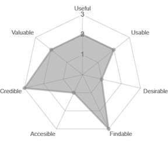
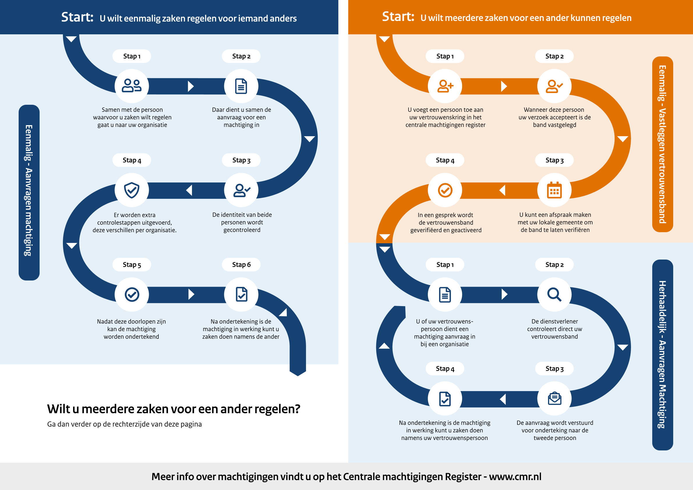
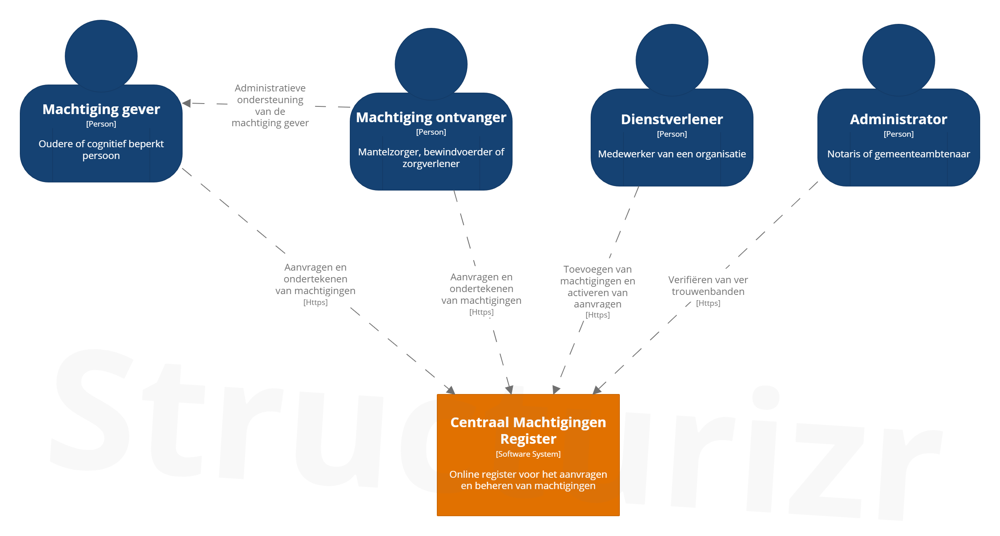
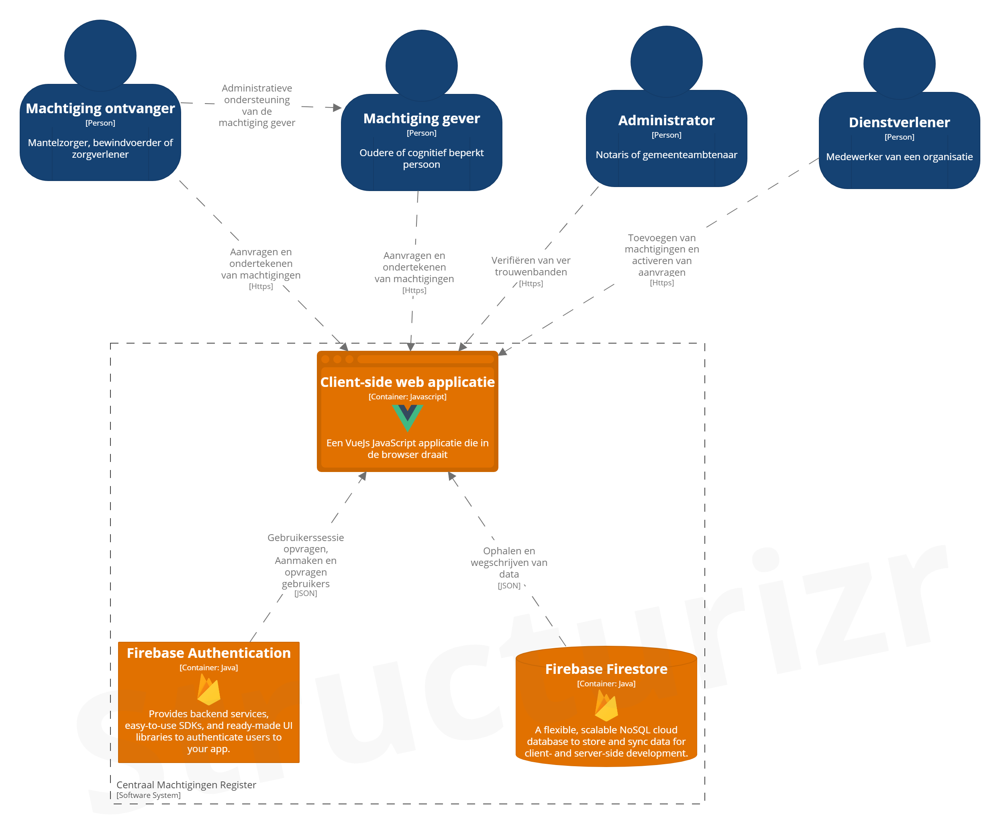
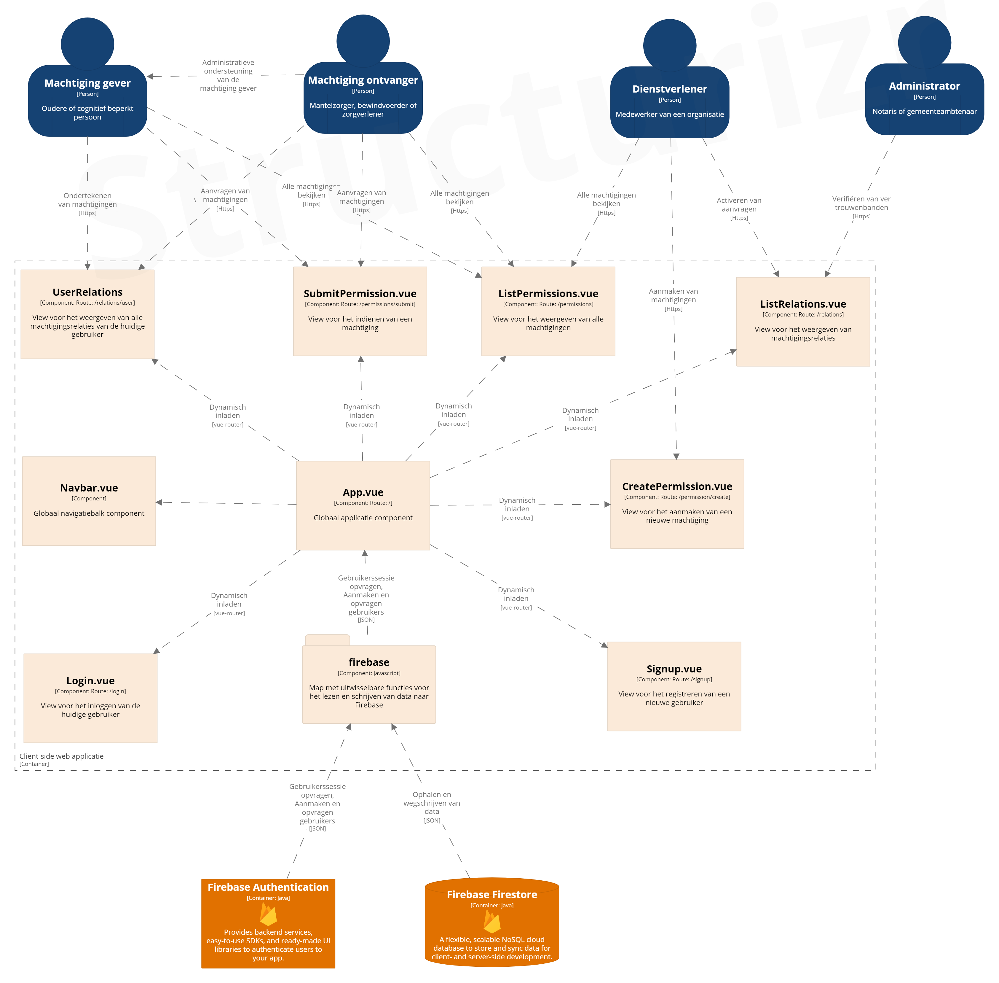
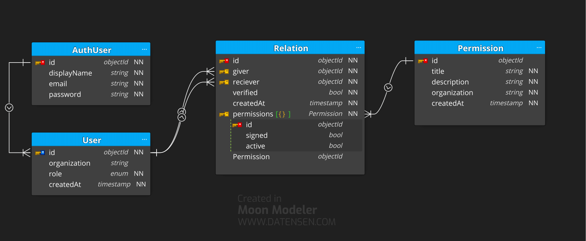
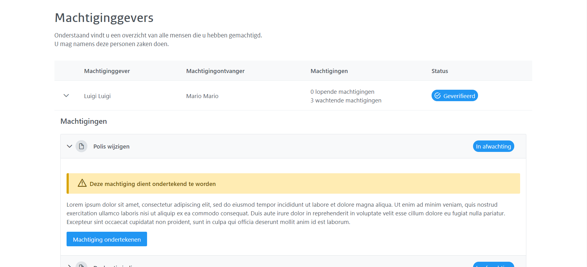
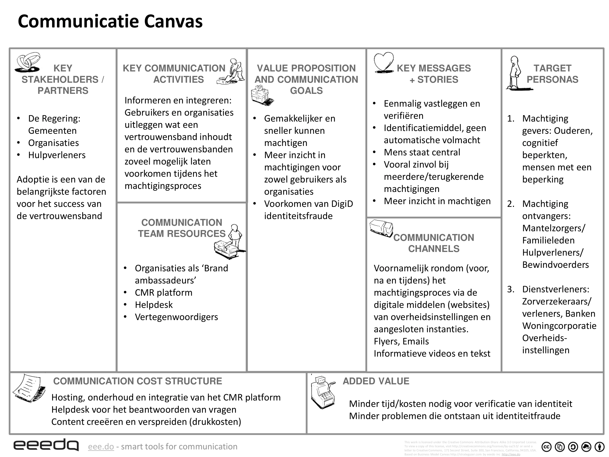

# &nbsp;

# 7. Testfase


## 	7.1 UX Framework :id=ux-framework

Nu het concept op twee benen staat is het tijd voor een evaluatie op UX gebied. Behalve user tests kunnen ook algemeen geldende guidelines/frameworks toegepast worden om een gebrekkige user experience te vermijden.

In dit hoofdstuk wordt de UX honeycomb van Peter Morville toegepast op de huidige versie van het concept en prototype.

 

Bovenstaande radar chart geeft de usability van ons concept en prototype weer. De waardering is voortgekomen uit een persoonlijke evaluatie van het product volgens de volgende schaal:

0 - Slecht: Dit aspect komt niet terug in het concept of prototype.

1 - Onvoldoende: Dit aspect wordt enigszins behandeld, maar mist toepassing.

2 - Voldoende: Dit aspect komt terug in het concept en prototype, maar heeft nog ruimte tot verbetering.

3 - Goed: Dit aspect sluit goed aan.

Het concept scoort vooral goed op credibility en findability, omdat de oplossing vanuit de overheid geïnitieerd kan worden. Om ervoor te zorgen dat deze credibility op een hoog niveau blijft, wordt de rijkshuisstijl op elke media uiting toegepast.

Desirability en accesibility daarentegen zijn twee grote obstakels die extra aandacht behoeven, omdat de machtigen op zichzelf niet het einddoel is, maar een middel tot het doel. De gebruikers krijgen daarmee eigenlijk alleen maar een extra stap in het proces. Door het machtigingsproces zo goed mogelijk te stroomlijnen en extra accesibility features toe te voegen voor gebruikers met beperkingen, kunnen deze aspecten verbeterd worden.

Valuability, Usefullness en Usability zouden voldoende moeten zijn, maar moeten wel getest worden om deze te valideren met de doelgroep. Er zullen daarom een uitgebreide testfase worden doorlopen om te ontdekken of en waar er verbetering nodig is.

>  [Meer informatie](/hoofdstukken/7.%20UX%20Framework.pdf ':ignore')

</br>

## 	7.2 Impression Test :id=impression-test

Een kernelement van het Centrale Machtigingenregister als concept zijn de vertrouwensbanden. Dit is uiteraard geen vanzelfsprekend onderwerp voor de doelgroep. Om dit onder de aandacht te brengen is kan een communicatiestrategie toegepast worden [(zie hoofdstuk 8.3)](#communicatiestrategie).

Eén van de uitgewerkte media uitingen uit deze strategie wordt getest om te ontdekken of dit aansluit op de doelgroep. De meest toegankelijke manier om dit te bereiken is een thinking aloud test. De bedoeling van deze test om de specifieke gedachtegang van de testpersonen te achterhalen, omdat zij een voor hun onbekend/nieuw concept krijgen voorgelegd. Er moet gecontroleerd worden of dit, op de juiste manier geïnterpreteerd wordt en de vorm van overdracht effectief is.

 


Eerst wordt de voorkennis van de testpersonen over het onderwerp gecontroleerd, waarna er na enkele opwarmoefeningen de gebruiker bovenstaande flyer krijgt voorgelegd.

De resultaten van de test waren dat over het algemeen het idee van een vertrouwensband begrepen werd. De oudere hulpbehoevende testpersonen hadden hier over het algemeen meer moeite mee dan mantelzorgers. Het vastleggen van vertrouwensbanden werd vooral gezien als extra administratieve taak, omdat het parallel loopt aan het huidige machtigingsproces. Voor alle testpersonen woog de meerwaarde van de vertrouwensband niet op tegen de extra moeite die het kost om deze vast te leggen. 

Daarbij communiceerde het stappenplan het concept niet goed genoeg door het gebrek aan context. 

>  [Meer informatie](/hoofdstukken/8.%20Impression%20Test.pdf ':ignore')

</br>

## 	7.3 AB test :id=ab-test

In een machtiging heb je twee rollen: Een machtiging gever en een machtiging ontvanger. 
Bij een machtiging aanvraag moet dit onderscheid er zijn, echter is de vraag of je dit ook wil vastleggen in de vertrouwensband. Er zijn namelijk twee opties: De eerste is een vertrouwensband die twee richtingen op werkt, waarbij geen onderscheid wordt gemaakt tussen machtiging gever en ontvanger, de rol wordt dan pas tijdens de machtiging aanvraag bepaald. De tweede optie is een vertrouwensband die in één richting werkt, waarin de rolverdeling alvast is vastgelegd. Door middel van een AB-test worden de twee opties vergeleken.

In deze AB test worden twee varianten van de vertrouwensbanden weergave van het Adobe XD prototype getest. De twee varianten zijn dusdanig vormgegeven dat het verschil tussen eenzijdige of tweezijdige vertrouwensbanden duidelijk naar voren komt. Gebruikers krijgen een korte taak waarna ze vragen moeten beantwoorden over het het scherm dat ze doorgelopen hebben en een score moeten geven voor beide schermen.


   


Ondanks dat de tweede figuren een soortgelijke score hadden, werd er bij het tweede prototype veel beter begrepen in welke richting machtigingen werkten en is deze daarom meer geschikt. Ook bleek uit de opdrachten die de testpersonen moesten voltooien, dat het voor hun veel intuïtiever was om bestaande relaties te machtigen en toe te voegen aan een vertrouwenskring dan nieuwe personen.

>  [Meer informatie](/hoofdstukken/9.%20AB%20Test.pdf ':ignore')

</br>

# 8. Ontwikkelfase

## 	8.1 POC vertrouwensbanden :id=poc-machtigingsrelaties

Voor het illustreren en testen van machtigingsrelaties en het Centrale Machtigingen Register als geheel is er een prototype gerealiseerd waarin alle rollen binnen het systeem aan bod komen. Gebruikers (machtiginggevers en -ontvangers) kunnen machtigingen aanvragen, ondertekenen en intrekken. Dienstverleners kunnen nieuwe machtigingen toevoegen aan het systeem en aangevraagde machtigingen activeren. Administrators (Notarissen en Ambtenaren) zijn in staat een relatie tussen een machtiginggever en -ontvanger te verifiëren.

In het kader van overdraagtbaarheid is het prototype openbaar op Github beschikbaar met bijgevoegd de onderstaande documentatie. Deze documentatie bestaat uit installatie instructies, een lijst van gebruikte dependecies, een gelaagde architectuurplaat en een database model.

 

------


### Front end setup

```
npm install
```

#### Compiles and hot-reloads for development

```
./node_modules/.bin/vue-cli-service serve --mode [aca/crowe]
```

#### Compiles and minifies for production

```
./node_modules/.bin/vue-cli-service build --mode [aca/crowe]
```

#### Lints and fixes files

```
npm run lint
```

#### Customize configuration

See [Configuration Reference](https://cli.vuejs.org/config/).

```
npm run lint
```


### Development dependecies

| Library              | Versie   | Uitgever          | Beschrijving                                                 | Documentatie                                                 |
| -------------------- | -------- | ----------------- | ------------------------------------------------------------ | ------------------------------------------------------------ |
| Node.js              | v14.17.0 | OpenJS Foundation | Node.js is a JavaScript runtime built on Chrome's V8 JavaScript engine. | https://strapi.io/documentation/3.0.0-beta.x/getting-started/introduction.html |
| Node package manager | 7.17.0   | npm inc. (GitHub) | npm is a package manager for the JavaScript programming language. | https://nodemailer.com/about/                                |
| Vue CLI              | 4.5.13   | Evan You          | Standard Tooling for Vue.js Development                      | https://cli.vuejs.org/                                       |

<div style="page-break-after: always;"></div>

### Dependencies

| Library    | Versie | Uitgever    | Beschrijving                                                 | Gebruik                                          | Documentatie                               |
| ---------- | ------ | ----------- | ------------------------------------------------------------ | ------------------------------------------------ | ------------------------------------------ |
| Core-js    | 3.14.0 | /           | The **Core** JavaScript Framework or "**CoreJS**" is a client-side JavaScript library which provides tools for creating object-oriented and event-driven JavaScript code | Onderliggende architectuur                       | https://github.com/zloirock/core-js#readme |
| Vue.js     | 3.1.0  | Evan You    | Vue.js is an open-source Model–view–viewmodel JavaScript framework for building user interfaces and single-page applications. | Algemene applicatie structuur                    | https://vuejs.org/                         |
| Vue Router | 4.0.8  | Evan You    | Vue Router is the official router for Vue.js                 | Dynamisch inladen van Views                      | https://router.vuejs.org/                  |
| Firebase   | 8.6.5  | Google, LLC | Backend as a Service platform.                               | Opslaan en ophalen van data en gebruikerssessies | https://firebase.google.com/docs           |
| PrimeVue   | 2.2.21 | PrimeFaces  | Versatile and performant [Vue](https://vuejs.org/) UI Component Library to help you build stunning user interfaces. | Styling en opbouw van de applicatie              | https://www.primefaces.org/primevue/       |

> Let op! Elk van de eerder benoemde libraries kan zelf ook dependencies hebben. Raadpleeg de bron van de desbetreffende dependency of de node_modules folder om meer te weten komen. 
>
> Ook kan het `npm list` command gebruikt worden om alle afhankelijkheden weer te geven.

### Ontwerp

Om inzicht te kunnen geven in de opbouw van de applicatie en de interactie tussen de verschillende componenten en gebruikers zijn er een aantal diagrammen gemaakt, zodat je als het ware een blauwdruk van je applicatie hebt. Deze diagrammen bestaan uit een software architectuur schets, een sequentie diagram en een entity relationship diagram (ERD) / database ontwerp. In deze paragraaf worden deze figuren behandeld. 

#### C4 Architectuur

Om de samenstelling van het systeem weer te geven zijn onderstaande architectuur diagrammen opgesteld. Samen vormen zij een geheel dat vormgegeven is volgens de C4 richtlijnen van Simon Brown (Brown, z.d.). Hierbij wordt in 4 lagen van buiten naar binnen weergegeven.

###### Context

De bovenste laag heet de context laag en geeft enkel software systemen en de interactie met en tussen de gebruikers weer. 




?>A System Context diagram is a good starting point for diagramming and documenting a software system, allowing you to step back and see the big picture. Draw a diagram showing your system as a box in the centre, surrounded by its users and the other systems that it interacts with.
?>
?>(Brown, z.d.)

###### Container

De tweede laag ontstaat wanneer je het Cyber Security systeem uitklapt en een zicht krijgt op de containers die het omvat. Deze containers zijn op zichzelf staande software implementaties waartussen communicatie plaatsvindt via specifieke protocollen.




?>The Container diagram shows the high-level shape of the software architecture and how responsibilities are distributed across it. It also shows the major technology choices and how the containers communicate with one another.
?>
?>(Brown, z.d.)

###### Component

Een laag dieper zit het component diagram die per implementatie weergeeft hoe deze is opgebouwd. Deze componenten zijn onafhankelijk functionerende stukjes software die uitgewisseld zouden kunnen met andere gelijksoortige componenten.



?>The Component diagram shows how a container is made up of a number of "components", what each of those components are, their responsibilities and the technology/implementation details.
?>
?>(Brown, z.d.)

#### NoSQL model

Onderstaand is het database model van de Firebase Firestore. Het geeft de velden en relaties van de verschillende collecties weer.




>  [Github](https://github.com/jensvlierop/machtigingsrelaties ':ignore')

</br>

## 	8.2 Usability Test :id=usability-test

In de vorige testen zijn de rol van machtiginggever en –ontvanger al uitgebreid behandeld. TIn dit onderdeel komen de twee andere doelgroepsegmenten ook aan bod, namelijk de dienstverleners en ambtenaren. Door middel van een usability test wordt er getest of het systeem een logische en intuïtieve oplossing biedt voor het probleem rondom machtigen.



De navigatie via de menubalk verliep snel en soepel, bij alledrie de testpersonen. Het grootste gedeelte van de controls in de applicatie kon met eenvoud gebruikt worden. 

Echter zorgde de meerlaagse structuur van het machtigingen– en relatieoverzicht voor verwarring en werd deze info op aparte pagina’s verwacht. Alle informatie in meerlaagse overzichten moet dus gescheiden worden in aparte pagina’s: Een apart overzicht voor machtigingsrelaties en lopende machtigingen met elk eigen status indicatoren. Ook moeten controls direct zichtbaar zijn voor de gebruiker in plaats van verborgen onder een dropdown. 

Daarnaast was de rol van de administrator binnen het systeem voor de testpersonen niet duidelijk en moet het verifiëren van een machtigingsrelatie moet beter worden toegelicht/uitgelicht.

Als laatste moeten er notificaties komen wanneer er belangrijke acties worden/zijn ondergaan, zodat de gebruikers beter weten wanneer ze iets moeten doen.

>  [Meer informatie](/hoofdstukken/10.%20Usability%20Test.pdf ':ignore')

</br>

## 	8.3 Communicatiestrategie :id=communicatiestrategie

Behalve de technische oplossing zelf wordt er ook aandacht besteed aan de marketing van het Centrale Machtigingenregister en in dit geval specifiek de vertrouwensbanden, omdat dit een heel nieuw concept is. Hiervoor kan een communicatiestrategie worden ingezet die in een plan beschreven is.

Onderstaand communicatie canvas (Junnonen, 2018) geeft in grove lijnen de inhoud van dit plan weer, de gehele versie is terug te vinden in de bijlagen.




Het primaire communicatiedoel is het uitleggen van de vertrouwensband, omdat dit in de  context van machtigen niet direct toepasselijk lijkt. Sterker nog, voor eenmalige machtigingen is een vertrouwensband niet eens nodig, maar bij meerdere of terugkerende machtigingen kan het zeker zinvol zijn, omdat dan 

De strategie berust op het gebruiken van de kanalen van de overheid en partnerships met organisaties om de adoptie van het systeem op gang te brengen.

> [Communicatiestrategie](/bijlagen/Communicatiestrategie.pdf ':ignore')
>
> [Storyboard](/bijlagen/Storyboard.pdf ':ignore')
>
> [Flyer](/bijlagen/Flyer.pdf ':ignore')

